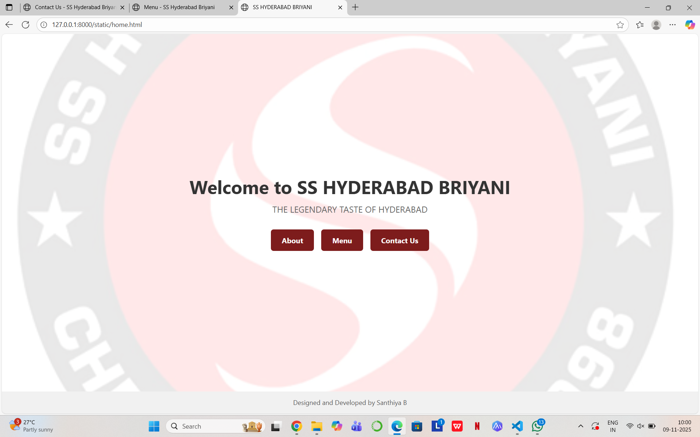
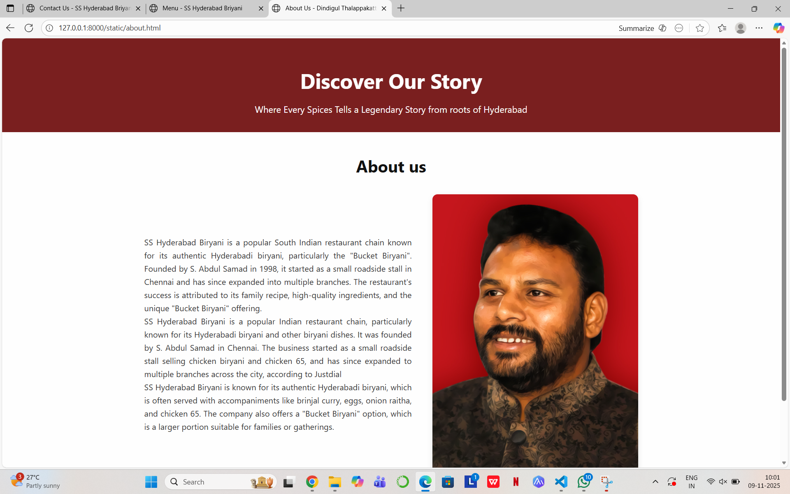
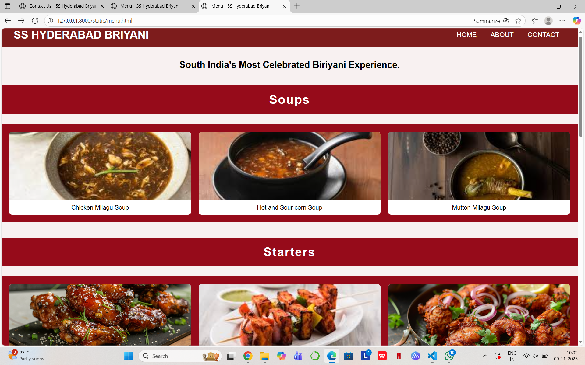
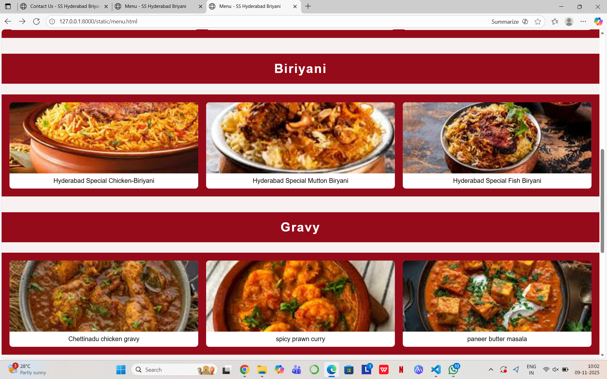
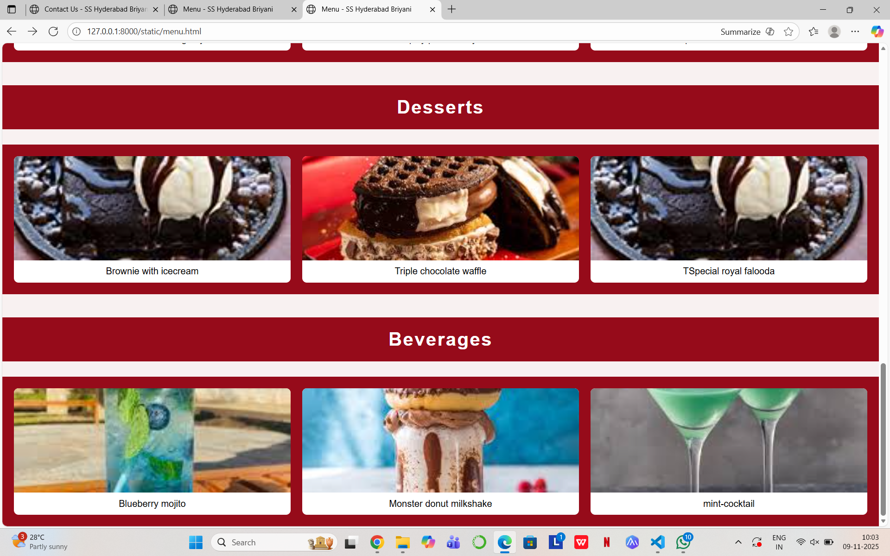
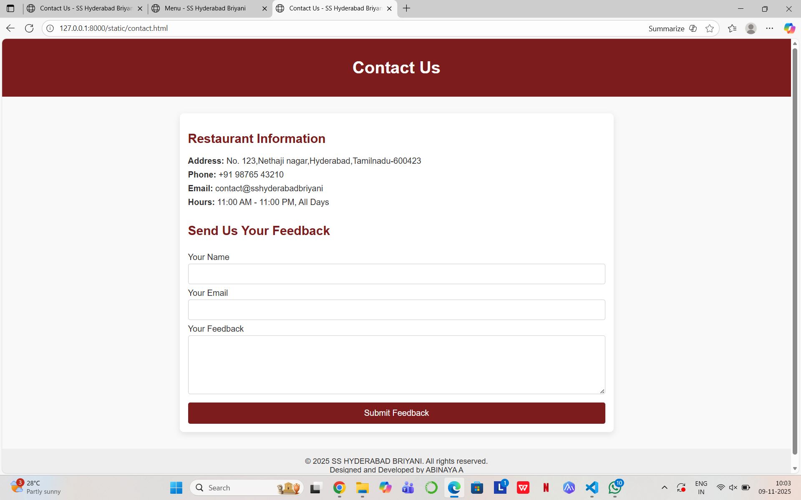

# Ex.07 Restuarant Website
## Date:

## AIM:
To develop a static Resturant website to display the menu and services provided by the resturant.

## DESIGN STEPS:

### Step 1:
Requirement collection.

### Step 2:
Creating the layout using HTML and CSS.

### Step 3:
Updating the sample content.

### Step 4:
Choose the appropriate style and color scheme.

### Step 5:
Validate the layout in various browsers.

### Step 6:
Validate the HTML code.

### Step 7:
Publish the website in the given URL.

## PROGRAM:
```

home.html
<!DOCTYPE html>
<html lang="en">
<head>
    <title>SS HYDERABAD BRIYANI</title>
    <style>
        /* Reset and full height layout */
        * {
            margin: 0;
            padding: 0;
            box-sizing: border-box;
        }

        html, body {
            height: 100%;
            font-family: 'Segoe UI', Tahoma, Geneva, Verdana, sans-serif;
            background: url('sslogo.avif') no-repeat center center fixed;
            background-size: cover;
            display: flex;
            flex-direction: column;
        }

        /* Center container */
        .container {
            flex: 1;
            display: flex;
            flex-direction: column;
            align-items: center;
            justify-content: center;
            text-align: center;
            padding: 40px 20px;
            background-color: rgba(255, 255, 255, 0.9); /* semi-transparent background */
        }

        .container h1 {
            font-size: 2.5rem;
            margin-bottom: 10px;
            color: #333;
        }

        .container p {
            font-size: 1.2rem;
            color: #666;
        }
        .button-group {
            display: flex;
            justify-content: center;
            gap: 1rem;
            margin-top: 2rem;
        }
        .btn {
            background-color: #7d1c1c;
            color: white;
            padding: 0.8rem 1.5rem;
            border-radius: 6px;
            text-decoration: none;
            font-weight: bold;
            transition: background-color 0.3s;
        }
        .btn:hover {
            background-color: #960b1a;
        }

        footer {
            text-align: center;
            padding: 15px;
            background-color: #f1f1f1;
            font-size: 0.9rem;
            color: #555;
        }
    </style>
</head>
<body>

    <div class="container">
        <h1>Welcome to SS HYDERABAD BRIYANI</h1>
        <p>THE LEGENDARY TASTE OF HYDERABAD</p>
        <div class="button-group">
            <a href="about.html" class="btn">About</a>
            <a href="menu.html" class="btn">Menu</a>
            <a href="contact.html" class="btn">Contact Us</a>
          </div>
    </div>

    <footer>
        Designed and Developed by Santhiya B
    </footer>

</body>
</html>
```
```
about.html
<!DOCTYPE html>
<html lang="en">
<head>
  <title>About Us - Dindigul Thalappakatti</title>
  <style>

    * {
      margin: 0;
      padding: 0;
      box-sizing: border-box;
    }

    body {
      font-family: 'Segoe UI', Tahoma, Geneva, Verdana, sans-serif;
      line-height: 1.6;
      background-color: #fefefe;
      color: #333;
      display: flex;
      flex-direction: column;
      min-height: 100vh;
    }

    header {
      background-color: #7a1f1f;
      color: white;
      text-align: center;
      padding: 50px 20px 30px;
    }

    header h1 {
      font-size: 2.5rem;
    }

    header p {
      font-size: 1.1rem;
      margin-top: 10px;
    }

    .content {
      flex: 1;
      padding: 40px 20px;
      max-width: 1000px;
      margin: auto;
      text-align: center;
    }

    .content h2 {
      font-size: 2rem;
      margin-bottom: 30px;
      color: #111;
    }

    .about-container {
      display: flex;
      flex-direction: column;
      align-items: center;
    }

    .about-text {
      text-align: justify;
      font-size: 1rem;
      max-width: 800px;
      margin-bottom: 30px;
    }

    .about-image {
      max-width: 100%;
      height: auto;
      border-radius: 10px;
      box-shadow: 0 4px 10px rgba(0, 0, 0, 0.1);
    }

    footer {
      background-color: #f8f9fa;
      padding: 15px;
      text-align: center;
      font-size: 0.9rem;
      color: #555;
    }

    @media (min-width: 768px) {
      .about-container {
        flex-direction: row;
        gap: 40px;
        justify-content: space-between;
      }

      .about-text {
        flex: 1;
      }

      .about-image {
        flex: 1;
        max-width: 400px;
      }
    }
  </style>
</head>
<body>

  <header>
    <h1>Discover Our Story</h1>
    <p>Where Every Spices Tells a Legendary Story from roots of Hyderabad
  </header>

  <div class="content">
    <h2>About us</h2>
    <div class="about-container">
      <div class="about-text">
        <p>
            SS Hyderabad Biryani is a popular South Indian restaurant chain known for its authentic Hyderabadi biryani, particularly the "Bucket Biryani". Founded by S. Abdul Samad in 1998, it started as a small roadside stall in Chennai and has since expanded into multiple branches. The restaurant's success is attributed to its family recipe, high-quality ingredients, and the unique "Bucket Biryani" offering.
        </p>
        <p>
            SS Hyderabad Biryani is a popular Indian restaurant chain, particularly known for its Hyderabadi biryani and other biryani dishes. It was founded by S. Abdul Samad in Chennai. The business started as a small roadside stall selling chicken biryani and chicken 65, and has since expanded to multiple branches across the city, according to Justdial
        </p>
        <p>
            SS Hyderabad Biryani is known for its authentic Hyderabadi biryani, which is often served with accompaniments like brinjal curry, eggs, onion raitha, and chicken 65. The company also offers a "Bucket Biryani" option, which is a larger portion suitable for families or gatherings. 

        </p>
      </div>
      
    </div>
  </div>

  <footer>
    Designed and Developed by Santhiya B
  </footer>

</body>
</html>

```

```
menu.html
<!DOCTYPE html>
<html lang="en">
<head>
  <title>Menu - SS Hyderabad Briyani</title>
  <style>
    body {
      margin: 0;
      font-family: Arial, sans-serif;
      background-color: #f8f1f1;
      color: #000;
    }

    header {
      background-color: #7d1c1c;
      padding: 1rem;
      display: flex;
      justify-content: space-between;
      align-items: center;
      color: white;
    }

    header h1 {
      margin: 0;
      font-size: 1.8rem;
      padding-left: 1rem;
    }

    nav a {
      color: white;
      text-decoration: none;
      margin-right: 2rem;
      font-size: 1.1rem;
    }

    .tagline {
      font-size: 1.5rem;
      font-weight: bold;
      text-align: center;
      margin: 2rem 0 1rem 0;
    }

    h2 {
      text-align: center;
      color: #fff;
      background-color: #960b1a;
      padding: 20px;
      margin-top: 40px;
      font-size: 2rem;
      letter-spacing: 2px;
    }

    .gallery {
      display: grid;
      grid-template-columns: repeat(auto-fit, minmax(220px, 1fr));
      gap: 20px;
      padding: 20px;
      background-color: #960b1a;
    }

    .gallery-item {
      background-color: #fff;
      border-radius: 8px;
      overflow: hidden;
      text-align: center;
      transition: transform 0.3s ease, box-shadow 0.3s ease;
    }

    .gallery-item:hover {
      transform: scale(1.05);
      box-shadow: 0 8px 20px rgba(0,0,0,0.2);
    }

    .gallery-item img {
      width: 100%;
      height: 180px;
      object-fit: cover;
      display: block;
    }

    .gallery-item p {
      margin: 10px;
      font-weight: 500;
    }

    @media (max-width: 600px) {
      h2 {
        font-size: 1.5rem;
      }
    }
  </style>
</head>
<body>
  <header>
    <h1>SS HYDERABAD BRIYANI</h1>
    <nav>
      <a href="home.html">HOME</a>
      <a href="about.html">ABOUT</a>
      <a href="contact.html">CONTACT</a>
    </nav>
  </header>

  <div class="tagline">
    South India's Most Celebrated Biriyani Experience.
  </div>

  <!-- Soups -->
  <h2>Soups</h2>
  <div class="gallery">
    <div class="gallery-item">
      
      <p>Chicken Milagu Soup</p>
    </div>
    <div class="gallery-item">
      
      <p>Hot and Sour corn Soup</p>
    </div>
    <div class="gallery-item">
      
      <p>Mutton Milagu Soup</p>
    </div>
  </div>

  <!-- Starters -->
  <h2>Starters</h2>
  <div class="gallery">
    <div class="gallery-item">
      
      <p>honey mustard chicken wings</p>
    </div>
    <div class="gallery-item">
      
      <p>paneer tikka</p>
    </div>
    <div class="gallery-item">
      
      <p>prawn fry</p>
    </div>
  </div>

  <!-- Biriyani -->
  <h2>Biriyani</h2>
  <div class="gallery">
    <div class="gallery-item">
      
      <p>Hyderabad Special Chicken-Biriyani</p>
    </div>
    <div class="gallery-item">
      
      <p>Hyderabad Special Mutton Biryani</p>
    </div>
    <div class="gallery-item">
      
      <p>Hyderabad Special Fish Biryani</p>
    </div>
  </div>

  <!-- Gravy -->
  <h2>Gravy</h2>
  <div class="gallery">
    <div class="gallery-item">
      
      <p>Chettinadu chicken gravy</p>
    </div>
    <div class="gallery-item">
      
      <p>spicy prawn curry</p>
    </div>
    <div class="gallery-item">
      
      <p>paneer butter masala</p>
    </div>
  </div>

  <!-- Desserts -->
  <h2>Desserts</h2>
  <div class="gallery">
    <div class="gallery-item">
      
      <p>Brownie with icecream</p>
    </div>
    <div class="gallery-item">
      
      <p>Triple chocolate waffle</p>
    </div>
    <div class="gallery-item">
      
      <p>TSpecial royal falooda</p>
    </div>
  </div>

  <!-- Beverages -->
  <h2>Beverages</h2>
  <div class="gallery">
    <div class="gallery-item">
      
      <p>Blueberry mojito</p>
    </div>
    <div class="gallery-item">
      
      <p>Monster donut milkshake</p>
    </div>
    <div class="gallery-item">
      
      <p>mint-cocktail</p>
    </div>
  </div>
</body>
</html>
```
```
contact.html
<!DOCTYPE html>
<html lang="en">
<head>
  <title>Contact Us - SS Hyderabad Briyani</title>
  <style>
    body {
      font-family: Arial, sans-serif;
      margin: 0;
      background-color: #f9f9f9;
      color: #333;
    }

    header {
      background-color: #7d1c1c;
      color: white;
      padding: 1rem;
      text-align: center;
    }

    .container {
      max-width: 800px;
      margin: 2rem auto;
      padding: 1rem;
      background-color: white;
      border-radius: 8px;
      box-shadow: 0 4px 12px rgba(0, 0, 0, 0.1);
    }

    h2 {
      color: #7d1c1c;
    }

    .contact-info {
      margin-bottom: 2rem;
    }

    .contact-info p {
      margin: 0.5rem 0;
    }

    form {
      display: flex;
      flex-direction: column;
    }

    label {
      margin: 0.5rem 0 0.2rem;
    }

    input, textarea {
      padding: 0.6rem;
      border: 1px solid #ccc;
      border-radius: 4px;
      font-size: 1rem;
    }

    textarea {
      resize: vertical;
    }

    button {
      margin-top: 1rem;
      background-color: #7d1c1c;
      color: white;
      padding: 0.7rem;
      border: none;
      border-radius: 4px;
      font-size: 1rem;
      cursor: pointer;
    }

    button:hover {
      background-color: #960b1a;
    }

    footer {
      text-align: center;
      padding: 1rem;
      margin-top: 2rem;
      background-color: #eee;
      font-size: 0.9rem;
    }
  </style>
</head>
<body>
  <header>
    <h1>Contact Us</h1>
  </header>

  <div class="container">
    <section class="contact-info">
      <h2>Restaurant Information</h2>
      <p><strong>Address:</strong> No. 123,Nethaji nagar,Hyderabad,Tamilnadu-600423</p>
      <p><strong>Phone:</strong> +91 98765 43210</p>
      <p><strong>Email:</strong> contact@sshyderabadbriyani
      <p><strong>Hours:</strong> 11:00 AM - 11:00 PM, All Days</p>
    </section>

    <section class="feedback-form">
      <h2>Send Us Your Feedback</h2>
      <form action="#" method="POST">
        <label for="name">Your Name</label>
        <input type="text" id="name" name="name" required />

        <label for="email">Your Email</label>
        <input type="email" id="email" name="email" required />

        <label for="message">Your Feedback</label>
        <textarea id="message" name="message" rows="5" required></textarea>

        <button type="submit">Submit Feedback</button>
      </form>
    </section>
  </div>

  <footer>
    &copy; 2025 SS HYDERABAD BRIYANI. All rights reserved.<BR>
    Designed and Developed by ABINAYA A
  </footer>
</body>
</html>
```
#

## OUTPUT:













## RESULT:
The program for designing software company website using HTML and CSS is completed successfully.
